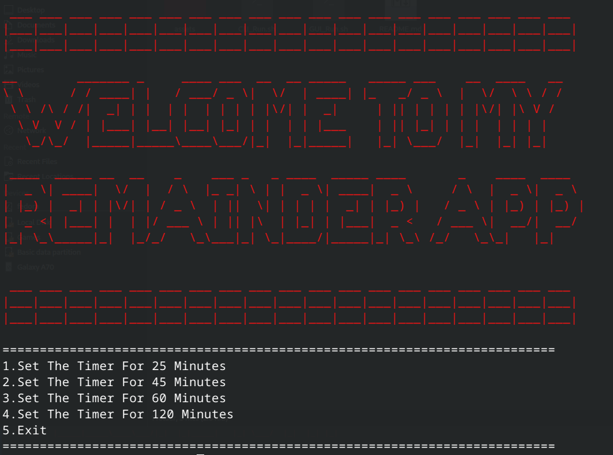

# Reminder_v1
this project is to make a remider that remind you to take a break from using laptop after a specific period of time 



### Installation

1. **Install figlet:**
   - On Debian-based systems: `sudo apt-get install figlet`
   - On Red Hat-based systems: `sudo yum install figlet`

2. **Install paplay:**
   - On Debian-based systems: `sudo apt-get install pulseaudio-utils`
   - On Red Hat-based systems: `sudo yum install alsa-utils`

3. Clone the repository and run the script:
   ```bash
   git clone https://github.com/your/repository.git
   cd repository
   ./Run.sh  ===> To Run The App on CommandLine Mode 
